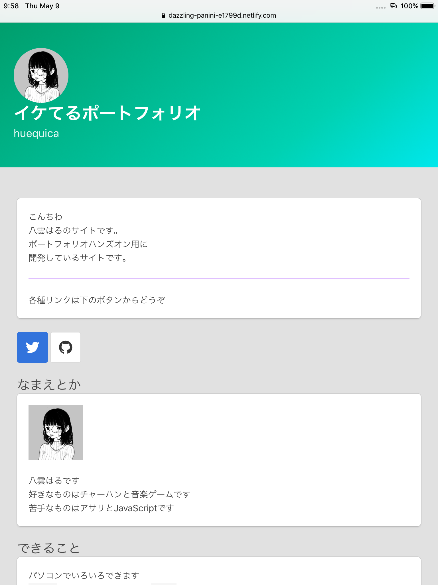
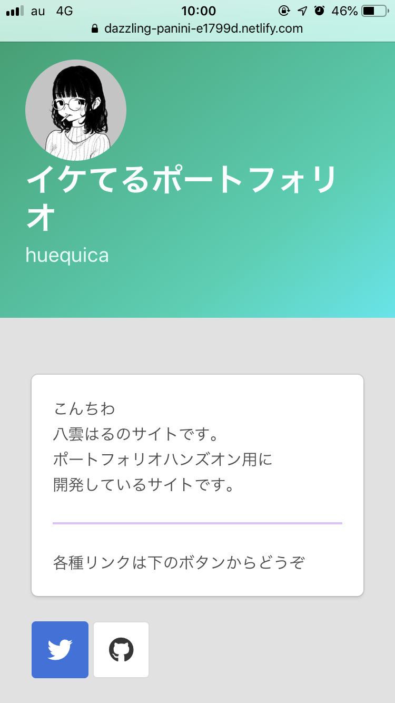
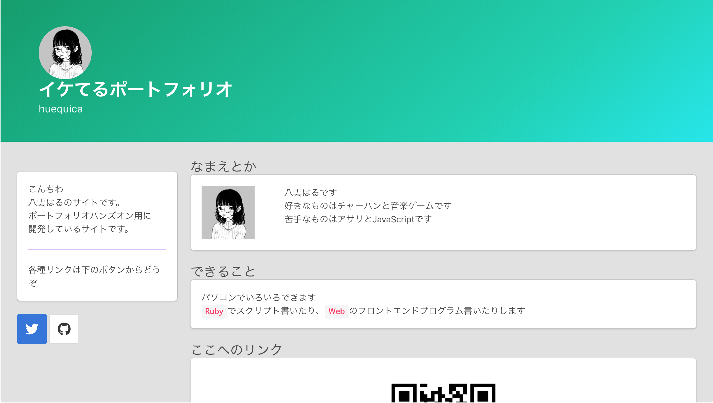

# Portfolio-HandsOn

## 使用するサイト
+ [Bulma](https://bulma.io)
+ [原色大辞典](https://www.colordic.org/)
+ [Font Awesome](https://fontawesome.com/)

## カラムのドキュメント
https://bulma.io/documentation/columns/basics/

## タイトルクラスのドキュメント
https://bulma.io/documentation/elements/title/

## ボタンクラスのドキュメント
https://bulma.io/documentation/elements/button/

# ScreenShots
+ iPad


+ iPhone


+ PC(Mac)



+ Copy this
```
<meta name="viewport"
 content="width=320,
    height=480,
    initial-scale=1.0,
    minimum-scale=1.0,
    maximum-scale=2.0,
    user-scalable=yes" />
```
